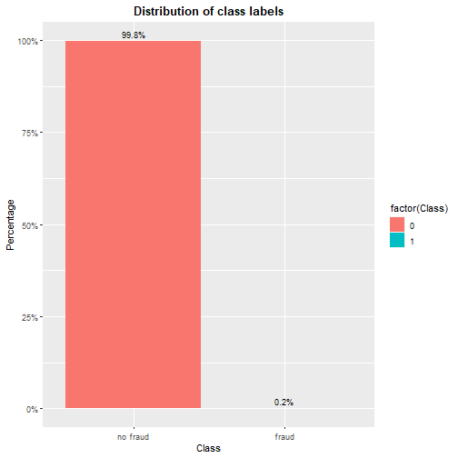
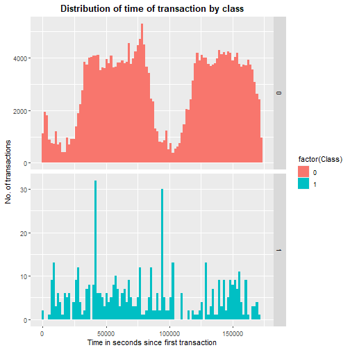
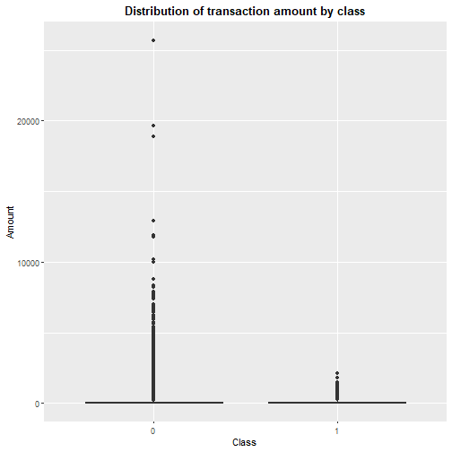
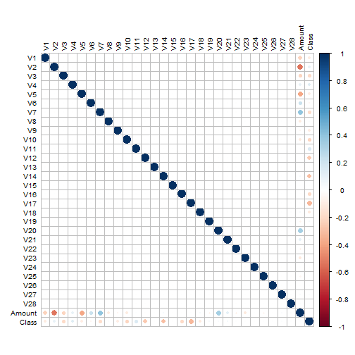
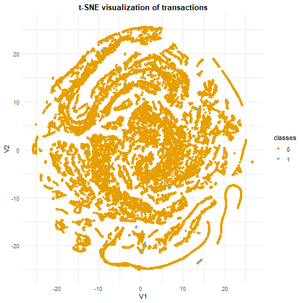
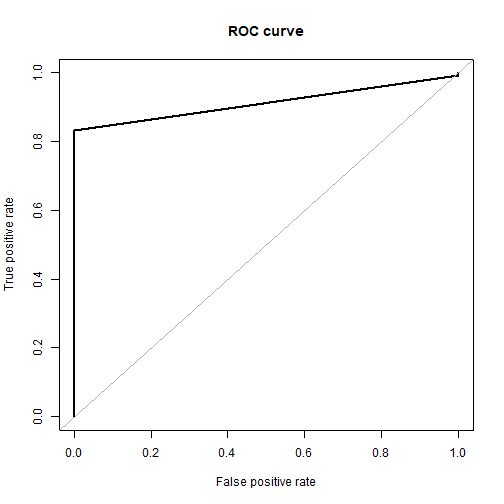
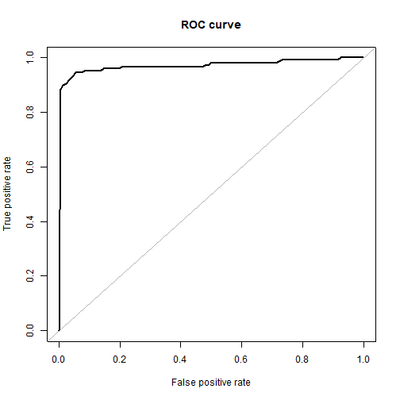
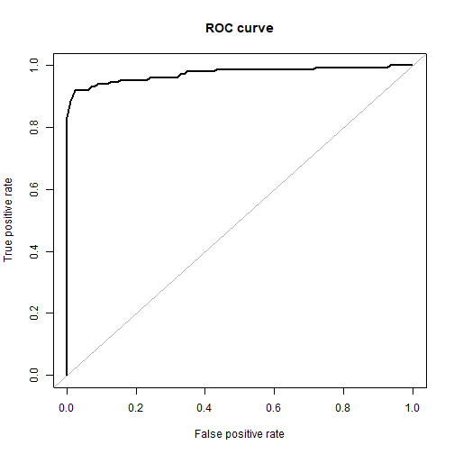
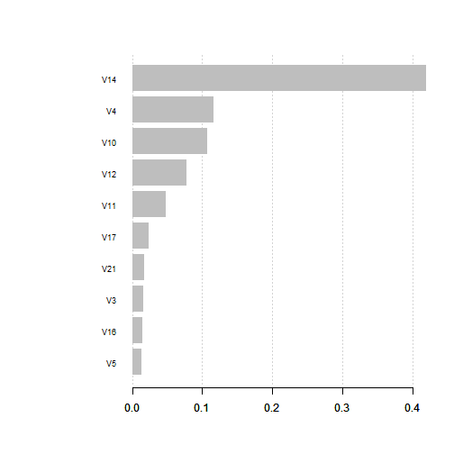

### Loading Packages


```r
library(caret)      # for sampling
library(caTools)    # for train/test split
library(dplyr)      # for data manipulation
library(stringr)    # for data manipulation
library(ggplot2)    # for data visualization
library(corrplot)   # for correlation
library(Rtsne)      # for tsne plotting
library(DMwR)       # for smote implementation
library(ROSE)       # for ROSE sampling
library(rpart)      # for decision tree model
library(Rborist)    # for random forest model
library(xgboost)    # for xgboost model
```

### Data Exploration


```r
# load data
data <- read.csv("./data/creditcard.csv")

## Basic Exploration
dim(data)
```

```
## [1] 284807     31
```

```r
head(data)
```

```
##   Time         V1          V2        V3         V4          V5          V6
## 1    0 -1.3598071 -0.07278117 2.5363467  1.3781552 -0.33832077  0.46238778
## 2    0  1.1918571  0.26615071 0.1664801  0.4481541  0.06001765 -0.08236081
## 3    1 -1.3583541 -1.34016307 1.7732093  0.3797796 -0.50319813  1.80049938
## 4    1 -0.9662717 -0.18522601 1.7929933 -0.8632913 -0.01030888  1.24720317
## 5    2 -1.1582331  0.87773675 1.5487178  0.4030339 -0.40719338  0.09592146
## 6    2 -0.4259659  0.96052304 1.1411093 -0.1682521  0.42098688 -0.02972755
##            V7          V8         V9         V10        V11         V12        V13
## 1  0.23959855  0.09869790  0.3637870  0.09079417 -0.5515995 -0.61780086 -0.9913898
## 2 -0.07880298  0.08510165 -0.2554251 -0.16697441  1.6127267  1.06523531  0.4890950
## 3  0.79146096  0.24767579 -1.5146543  0.20764287  0.6245015  0.06608369  0.7172927
## 4  0.23760894  0.37743587 -1.3870241 -0.05495192 -0.2264873  0.17822823  0.5077569
## 5  0.59294075 -0.27053268  0.8177393  0.75307443 -0.8228429  0.53819555  1.3458516
## 6  0.47620095  0.26031433 -0.5686714 -0.37140720  1.3412620  0.35989384 -0.3580907
##          V14        V15        V16         V17         V18         V19         V20
## 1 -0.3111694  1.4681770 -0.4704005  0.20797124  0.02579058  0.40399296  0.25141210
## 2 -0.1437723  0.6355581  0.4639170 -0.11480466 -0.18336127 -0.14578304 -0.06908314
## 3 -0.1659459  2.3458649 -2.8900832  1.10996938 -0.12135931 -2.26185710  0.52497973
## 4 -0.2879237 -0.6314181 -1.0596472 -0.68409279  1.96577500 -1.23262197 -0.20803778
## 5 -1.1196698  0.1751211 -0.4514492 -0.23703324 -0.03819479  0.80348692  0.40854236
## 6 -0.1371337  0.5176168  0.4017259 -0.05813282  0.06865315 -0.03319379  0.08496767
##            V21          V22         V23         V24        V25        V26
## 1 -0.018306778  0.277837576 -0.11047391  0.06692807  0.1285394 -0.1891148
## 2 -0.225775248 -0.638671953  0.10128802 -0.33984648  0.1671704  0.1258945
## 3  0.247998153  0.771679402  0.90941226 -0.68928096 -0.3276418 -0.1390966
## 4 -0.108300452  0.005273597 -0.19032052 -1.17557533  0.6473760 -0.2219288
## 5 -0.009430697  0.798278495 -0.13745808  0.14126698 -0.2060096  0.5022922
## 6 -0.208253515 -0.559824796 -0.02639767 -0.37142658 -0.2327938  0.1059148
##            V27         V28 Amount Class
## 1  0.133558377 -0.02105305 149.62     0
## 2 -0.008983099  0.01472417   2.69     0
## 3 -0.055352794 -0.05975184 378.66     0
## 4  0.062722849  0.06145763 123.50     0
## 5  0.219422230  0.21515315  69.99     0
## 6  0.253844225  0.08108026   3.67     0
```

```r
str(data)
```

```
## 'data.frame':	284807 obs. of  31 variables:
##  $ Time  : num  0 0 1 1 2 2 4 7 7 9 ...
##  $ V1    : num  -1.36 1.192 -1.358 -0.966 -1.158 ...
##  $ V2    : num  -0.0728 0.2662 -1.3402 -0.1852 0.8777 ...
##  $ V3    : num  2.536 0.166 1.773 1.793 1.549 ...
##  $ V4    : num  1.378 0.448 0.38 -0.863 0.403 ...
##  $ V5    : num  -0.3383 0.06 -0.5032 -0.0103 -0.4072 ...
##  $ V6    : num  0.4624 -0.0824 1.8005 1.2472 0.0959 ...
##  $ V7    : num  0.2396 -0.0788 0.7915 0.2376 0.5929 ...
##  $ V8    : num  0.0987 0.0851 0.2477 0.3774 -0.2705 ...
##  $ V9    : num  0.364 -0.255 -1.515 -1.387 0.818 ...
##  $ V10   : num  0.0908 -0.167 0.2076 -0.055 0.7531 ...
##  $ V11   : num  -0.552 1.613 0.625 -0.226 -0.823 ...
##  $ V12   : num  -0.6178 1.0652 0.0661 0.1782 0.5382 ...
##  $ V13   : num  -0.991 0.489 0.717 0.508 1.346 ...
##  $ V14   : num  -0.311 -0.144 -0.166 -0.288 -1.12 ...
##  $ V15   : num  1.468 0.636 2.346 -0.631 0.175 ...
##  $ V16   : num  -0.47 0.464 -2.89 -1.06 -0.451 ...
##  $ V17   : num  0.208 -0.115 1.11 -0.684 -0.237 ...
##  $ V18   : num  0.0258 -0.1834 -0.1214 1.9658 -0.0382 ...
##  $ V19   : num  0.404 -0.146 -2.262 -1.233 0.803 ...
##  $ V20   : num  0.2514 -0.0691 0.525 -0.208 0.4085 ...
##  $ V21   : num  -0.01831 -0.22578 0.248 -0.1083 -0.00943 ...
##  $ V22   : num  0.27784 -0.63867 0.77168 0.00527 0.79828 ...
##  $ V23   : num  -0.11 0.101 0.909 -0.19 -0.137 ...
##  $ V24   : num  0.0669 -0.3398 -0.6893 -1.1756 0.1413 ...
##  $ V25   : num  0.129 0.167 -0.328 0.647 -0.206 ...
##  $ V26   : num  -0.189 0.126 -0.139 -0.222 0.502 ...
##  $ V27   : num  0.13356 -0.00898 -0.05535 0.06272 0.21942 ...
##  $ V28   : num  -0.0211 0.0147 -0.0598 0.0615 0.2152 ...
##  $ Amount: num  149.62 2.69 378.66 123.5 69.99 ...
##  $ Class : int  0 0 0 0 0 0 0 0 0 0 ...
```

```r
summary(data)
```

```
##       Time              V1                  V2                  V3          
##  Min.   :     0   Min.   :-56.40751   Min.   :-72.71573   Min.   :-48.3256  
##  1st Qu.: 54202   1st Qu.: -0.92037   1st Qu.: -0.59855   1st Qu.: -0.8904  
##  Median : 84692   Median :  0.01811   Median :  0.06549   Median :  0.1799  
##  Mean   : 94814   Mean   :  0.00000   Mean   :  0.00000   Mean   :  0.0000  
##  3rd Qu.:139321   3rd Qu.:  1.31564   3rd Qu.:  0.80372   3rd Qu.:  1.0272  
##  Max.   :172792   Max.   :  2.45493   Max.   : 22.05773   Max.   :  9.3826  
##        V4                 V5                   V6                 V7          
##  Min.   :-5.68317   Min.   :-113.74331   Min.   :-26.1605   Min.   :-43.5572  
##  1st Qu.:-0.84864   1st Qu.:  -0.69160   1st Qu.: -0.7683   1st Qu.: -0.5541  
##  Median :-0.01985   Median :  -0.05434   Median : -0.2742   Median :  0.0401  
##  Mean   : 0.00000   Mean   :   0.00000   Mean   :  0.0000   Mean   :  0.0000  
##  3rd Qu.: 0.74334   3rd Qu.:   0.61193   3rd Qu.:  0.3986   3rd Qu.:  0.5704  
##  Max.   :16.87534   Max.   :  34.80167   Max.   : 73.3016   Max.   :120.5895  
##        V8                  V9                 V10                 V11          
##  Min.   :-73.21672   Min.   :-13.43407   Min.   :-24.58826   Min.   :-4.79747  
##  1st Qu.: -0.20863   1st Qu.: -0.64310   1st Qu.: -0.53543   1st Qu.:-0.76249  
##  Median :  0.02236   Median : -0.05143   Median : -0.09292   Median :-0.03276  
##  Mean   :  0.00000   Mean   :  0.00000   Mean   :  0.00000   Mean   : 0.00000  
##  3rd Qu.:  0.32735   3rd Qu.:  0.59714   3rd Qu.:  0.45392   3rd Qu.: 0.73959  
##  Max.   : 20.00721   Max.   : 15.59500   Max.   : 23.74514   Max.   :12.01891  
##       V12                V13                V14                V15          
##  Min.   :-18.6837   Min.   :-5.79188   Min.   :-19.2143   Min.   :-4.49894  
##  1st Qu.: -0.4056   1st Qu.:-0.64854   1st Qu.: -0.4256   1st Qu.:-0.58288  
##  Median :  0.1400   Median :-0.01357   Median :  0.0506   Median : 0.04807  
##  Mean   :  0.0000   Mean   : 0.00000   Mean   :  0.0000   Mean   : 0.00000  
##  3rd Qu.:  0.6182   3rd Qu.: 0.66251   3rd Qu.:  0.4931   3rd Qu.: 0.64882  
##  Max.   :  7.8484   Max.   : 7.12688   Max.   : 10.5268   Max.   : 8.87774  
##       V16                 V17                 V18                 V19           
##  Min.   :-14.12985   Min.   :-25.16280   Min.   :-9.498746   Min.   :-7.213527  
##  1st Qu.: -0.46804   1st Qu.: -0.48375   1st Qu.:-0.498850   1st Qu.:-0.456299  
##  Median :  0.06641   Median : -0.06568   Median :-0.003636   Median : 0.003735  
##  Mean   :  0.00000   Mean   :  0.00000   Mean   : 0.000000   Mean   : 0.000000  
##  3rd Qu.:  0.52330   3rd Qu.:  0.39968   3rd Qu.: 0.500807   3rd Qu.: 0.458949  
##  Max.   : 17.31511   Max.   :  9.25353   Max.   : 5.041069   Max.   : 5.591971  
##       V20                 V21                 V22                  V23           
##  Min.   :-54.49772   Min.   :-34.83038   Min.   :-10.933144   Min.   :-44.80774  
##  1st Qu.: -0.21172   1st Qu.: -0.22839   1st Qu.: -0.542350   1st Qu.: -0.16185  
##  Median : -0.06248   Median : -0.02945   Median :  0.006782   Median : -0.01119  
##  Mean   :  0.00000   Mean   :  0.00000   Mean   :  0.000000   Mean   :  0.00000  
##  3rd Qu.:  0.13304   3rd Qu.:  0.18638   3rd Qu.:  0.528554   3rd Qu.:  0.14764  
##  Max.   : 39.42090   Max.   : 27.20284   Max.   : 10.503090   Max.   : 22.52841  
##       V24                V25                 V26                V27            
##  Min.   :-2.83663   Min.   :-10.29540   Min.   :-2.60455   Min.   :-22.565679  
##  1st Qu.:-0.35459   1st Qu.: -0.31715   1st Qu.:-0.32698   1st Qu.: -0.070840  
##  Median : 0.04098   Median :  0.01659   Median :-0.05214   Median :  0.001342  
##  Mean   : 0.00000   Mean   :  0.00000   Mean   : 0.00000   Mean   :  0.000000  
##  3rd Qu.: 0.43953   3rd Qu.:  0.35072   3rd Qu.: 0.24095   3rd Qu.:  0.091045  
##  Max.   : 4.58455   Max.   :  7.51959   Max.   : 3.51735   Max.   : 31.612198  
##       V28                Amount             Class         
##  Min.   :-15.43008   Min.   :    0.00   Min.   :0.000000  
##  1st Qu.: -0.05296   1st Qu.:    5.60   1st Qu.:0.000000  
##  Median :  0.01124   Median :   22.00   Median :0.000000  
##  Mean   :  0.00000   Mean   :   88.35   Mean   :0.001728  
##  3rd Qu.:  0.07828   3rd Qu.:   77.17   3rd Qu.:0.000000  
##  Max.   : 33.84781   Max.   :25691.16   Max.   :1.000000
```

```r
# check for missing values
colSums(is.na(data))
```

```
##   Time     V1     V2     V3     V4     V5     V6     V7     V8     V9    V10 
##      0      0      0      0      0      0      0      0      0      0      0 
##    V11    V12    V13    V14    V15    V16    V17    V18    V19    V20    V21 
##      0      0      0      0      0      0      0      0      0      0      0 
##    V22    V23    V24    V25    V26    V27    V28 Amount  Class 
##      0      0      0      0      0      0      0      0      0
```

```r
# check class
table(data$Class)
```

```
## 
##      0      1 
## 284315    492
```

```r
prop.table(table(data$Class))
```

```
## 
##           0           1 
## 0.998272514 0.001727486
```

```r
common_theme <- theme(plot.title = element_text(hjust = 0.5, face = "bold"))

# distribution of class labels
ggplot(data = data, aes(x = factor(Class), 
                        y = prop.table(stat(count)), 
                        fill = factor(Class),
                        label = scales::percent(prop.table(stat(count)), accuracy = 0.1))) +
    geom_bar(position = "dodge") + 
    geom_text(stat = 'count',
              position = position_dodge(0.90), 
              vjust = -0.5, 
              size = 3) + 
    scale_x_discrete(labels = c("no fraud", "fraud")) +
    scale_y_continuous(labels = scales::percent) +
    labs(x = 'Class', y = 'Percentage') +
    ggtitle("Distribution of class labels") +
    common_theme
```



### Data Visualization

Distribution of time of transaction by class


```r
ggplot(data = data, aes(x = Time, fill = factor(Class))) +
    geom_histogram(bins = 100) +
    facet_grid(Class~., scales = "free_y") +
    labs(x = "Time in seconds since first transaction", y = "No. of transactions") +
    ggtitle("Distribution of time of transaction by class") +
    common_theme
```



Distribution of variable 'Amount' by Class


```r
ggplot(data = data, aes(x = factor(Class), y = Amount)) +
    geom_boxplot() +
    labs(x = "Class", y = "Amount") +
    ggtitle("Distribution of transaction amount by class") +
    common_theme
```



Correlation


```r
correlations <- cor(data[,-1], method = "pearson")
corrplot(correlations, number.cex = 0.9, method = "circle", 
         type = "full", tl.cex = 0.8, tl.col = "black")
```



Visualization of transactions using t-SNE


```r
# Use 10% data to compute t-SNE
tsne_subset <- 1:as.integer(0.1*nrow(data))
tsne <- Rtsne(data[tsne_subset,-c(1,31)], perplexity = 20, theta = 0.5,
              pca = FALSE, max_iter = 500, verbose = FALSE, check_duplicates = FALSE)

classes <- as.factor(data$Class[tsne_subset])
tsne_mat <- as.data.frame(tsne$Y)

ggplot(tsne_mat, aes(x = V1, y = V2)) + 
    geom_point(aes(color = classes)) +
    theme_minimal() +
    ggtitle("t-SNE visualization of transactions") +
    scale_color_manual(values = c("#E69F00", "#56B4E9")) +
    common_theme
```




### Modeling Approach

SMOTE - synthetic minority oversampling technique
ROSE - random over-sampling examples

Data preparation


```r
# remove 'Time' variable
data <- data[,-1]
data$Class <- as.factor(data$Class)
levels(data$Class) <- c("Not Fraud", "Fraud")

# scale numeric variables
data[,-30] <- scale(data[,-30])
head(data)
```

```
##           V1          V2        V3         V4           V5          V6         V7
## 1 -0.6942411 -0.04407485 1.6727706  0.9733638 -0.245116153  0.34706734  0.1936786
## 2  0.6084953  0.16117564 0.1097969  0.3165224  0.043483276 -0.06181986 -0.0637001
## 3 -0.6934992 -0.81157640 1.1694664  0.2682308 -0.364571146  1.35145121  0.6397745
## 4 -0.4933240 -0.11216923 1.1825144 -0.6097256 -0.007468867  0.93614819  0.1920703
## 5 -0.5913287  0.53154012 1.0214099  0.2846549 -0.295014918  0.07199846  0.4793014
## 6 -0.2174742  0.58167387 0.7525841 -0.1188331  0.305008424 -0.02231344  0.3849353
##            V8         V9         V10        V11        V12        V13        V14
## 1  0.08263713  0.3311272  0.08338540 -0.5404061 -0.6182946 -0.9960972 -0.3246096
## 2  0.07125336 -0.2324938 -0.15334936  1.5800001  1.0660867  0.4914173 -0.1499822
## 3  0.20737237 -1.3786729  0.19069928  0.6118286  0.0661365  0.7206986 -0.1731136
## 4  0.31601704 -1.2625010 -0.05046786 -0.2218912  0.1783707  0.5101678 -0.3003600
## 5 -0.22650983  0.7443250  0.69162382 -0.8061452  0.5386257  1.3522420 -1.1680315
## 6  0.21795429 -0.5176177 -0.34110050  1.3140441  0.3601815 -0.3597909 -0.1430569
##          V15        V16         V17         V18         V19         V20
## 1  1.6040110 -0.5368319  0.24486302  0.03076988  0.49628116  0.32611744
## 2  0.6943592  0.5294328 -0.13516973 -0.21876220 -0.17908573 -0.08961071
## 3  2.5629017 -3.2982296  1.30686559 -0.14478974 -2.77855597  0.68097378
## 4 -0.6898362 -1.2092939 -0.80544323  2.34530040 -1.51420227 -0.26985475
## 5  0.1913231 -0.5152042 -0.27908030 -0.04556892  0.98703556  0.52993786
## 6  0.5655061  0.4584589 -0.06844494  0.08190778 -0.04077658  0.11021522
##           V21          V22         V23        V24        V25        V26
## 1 -0.02492332  0.382853766 -0.17691102  0.1105067  0.2465850 -0.3921697
## 2 -0.30737626 -0.880075209  0.16220090 -0.5611296  0.3206933  0.2610690
## 3  0.33763110  1.063356404  1.45631719 -1.1380901 -0.6285356 -0.2884462
## 4 -0.14744304  0.007266895 -0.30477601 -1.9410237  1.2419015 -0.4602165
## 5 -0.01283920  1.100009340 -0.22012301  0.2332497 -0.3952009  1.0416095
## 6 -0.28352172 -0.771425648 -0.04227277 -0.6132723 -0.4465828  0.2196368
##           V27         V28      Amount     Class
## 1  0.33089104 -0.06378104  0.24496383 Not Fraud
## 2 -0.02225564  0.04460744 -0.34247394 Not Fraud
## 3 -0.13713661 -0.18102051  1.16068389 Not Fraud
## 4  0.15539593  0.18618826  0.14053401 Not Fraud
## 5  0.54361884  0.65181477 -0.07340321 Not Fraud
## 6  0.62889938  0.24563577 -0.33855582 Not Fraud
```

Split data into train and test sets


```r
set.seed(123)
split <- sample.split(data$Class, SplitRatio = 0.7)
train <- subset(data, split == TRUE)
test <- subset(data, split == FALSE)
```

Let us create different versions of the training set as per sampling technique


```r
table(train$Class)
```

```
## 
## Not Fraud     Fraud 
##    199020       344
```

```r
# under sampling
set.seed(1951)
down_train <- downSample(x = train[,-ncol(train)], y = train$Class)
table(down_train$Class)
```

```
## 
## Not Fraud     Fraud 
##       344       344
```

```r
# over sampling
set.seed(1951)
up_train <- upSample(x = train[,-ncol(train)], y = train$Class)
table(up_train$Class)
```

```
## 
## Not Fraud     Fraud 
##    199020    199020
```

```r
# Synthetic data generation

# SMOTE
set.seed(1951)
smote_train <- SMOTE(Class~., train)
table(smote_train$Class)
```

```
## 
## Not Fraud     Fraud 
##      1376      1032
```

```r
# ROSE
set.seed(1951)
rose_train <- ROSE(Class~., train)$data
table(rose_train$Class)
```

```
## 
## Not Fraud     Fraud 
##     99451     99913
```

```r
# CART model performance on imbalanced data
set.seed(1591)
orig_fit <- rpart(Class~., data = train)

# evaluate model performance on test set
pred_orig <- predict(orig_fit, newdata = test, method = "class")

roc.curve(test$Class, pred_orig[,2], plotit = TRUE)    # AUC : 0.912
```



```
## Area under the curve (AUC): 0.912
```

```r
# down sampled model
set.seed(1591)
down_fit <- rpart(Class~., data = down_train)
pred_down <- predict(down_fit, newdata = test)

roc.curve(test$Class, pred_down[,2], plotit = FALSE)   # AUC : 0.942
```

```
## Area under the curve (AUC): 0.949
```

```r
# up sampled model
set.seed(1591)
up_fit <- rpart(Class~., data = up_train)
pred_up <- predict(up_fit, newdata = test)
roc.curve(test$Class, pred_up[,2], plotit = FALSE)     # AUC : 0.943
```

```
## Area under the curve (AUC): 0.937
```

```r
# SMOTE
set.seed(1591)
smote_fit <- rpart(Class~., data = smote_train)
pred_smote <- predict(smote_fit, newdata = test)
roc.curve(test$Class, pred_smote[,2], plotit = FALSE)  # AUC : 0.934
```

```
## Area under the curve (AUC): 0.943
```

```r
# ROSE
set.seed(1591)
rose_fit <- rpart(Class~., data = rose_train)
pred_rose <- predict(rose_fit, newdata = test)
roc.curve(test$Class, pred_rose[,2], plotit = FALSE)   # AUC : 0.942
```

```
## Area under the curve (AUC): 0.942
```


### Logistic Regression (GLM) Fit


```r
glm_fit <- glm(Class~., data = up_train, family = "binomial")
pred_glm <- predict(glm_fit, newdata = test, type = "response")

roc.curve(test$Class, pred_glm, plotit = TRUE)         # AUC : 0.971
```



```
## Area under the curve (AUC): 0.971
```

### Random Forest Fit


```r
x <- up_train[,-30]
y <- up_train[,30]

rf_fit <- Rborist(x, y, nTree = 1000, minNode = 20, maxLeaf = 13)
pred_rf <- predict(rf_fit, newdata = test[,-30], ctgCensus = "prob")

roc.curve(test$Class, pred_rf$prob[,2], plotit = TRUE) # AUC : 0.973
```



```
## Area under the curve (AUC): 0.973
```

### XGB fit


```r
# convert class labels from factor to numeric
labels <- up_train$Class
y <- recode(labels, "Not Fraud" = 0, "Fraud" = 1)

xgb_fit <- xgboost(data = data.matrix(up_train[,-30]), 
                   label = y, 
                   eta = 0.1, 
                   gamma = 0.1, 
                   max_depth = 10, 
                   nrounds = 300, 
                   objective = "binary:logistic",
                   colsample_bytree = 0.6,
                   verbose = 0,
                   nthread = 7,
                   seed = 42)
pred_xgb <- predict(xgb_fit, data.matrix(test[,-30]))

roc.curve(test$Class, pred_xgb, plotit = TRUE)        # AUC : 0.974
```


```
## Area under the curve (AUC): 0.974
```

Important features


```r
names <- dimnames(data.matrix(up_train[,-30]))[[2]]

# Compute feature importance matrix
importance_matrix <- xgb.importance(names, model = xgb_fit)

# graph
xgb.plot.importance(importance_matrix[1:10,])
```




