### What is Customer Segmentation?

Customer Segmentation is the process of division of customer base into several groups of individuals that share a similarity in different ways that are relevant to marketing such as gender, age, interests, and miscellaneous spending habits.

### Loading Packages

```r
library(plotrix)
library(purrr)
library(cluster)
library(gridExtra)
library(grid)
library(NbClust)
library(factoextra)
```

### Data Exploration


```r
customer_data <- read.csv("./data/Mall_Customers.csv")

str(customer_data)
```

```
## 'data.frame':	200 obs. of  5 variables:
##  $ CustomerID            : int  1 2 3 4 5 6 7 8 9 10 ...
##  $ Gender                : chr  "Male" "Male" "Female" "Female" ...
##  $ Age                   : int  19 21 20 23 31 22 35 23 64 30 ...
##  $ Annual.Income..k..    : int  15 15 16 16 17 17 18 18 19 19 ...
##  $ Spending.Score..1.100.: int  39 81 6 77 40 76 6 94 3 72 ...
```

```r
names(customer_data)
```

```
## [1] "CustomerID"             "Gender"                 "Age"                   
## [4] "Annual.Income..k.."     "Spending.Score..1.100."
```

```r
head(customer_data)
```

```
##   CustomerID Gender Age Annual.Income..k.. Spending.Score..1.100.
## 1          1   Male  19                 15                     39
## 2          2   Male  21                 15                     81
## 3          3 Female  20                 16                      6
## 4          4 Female  23                 16                     77
## 5          5 Female  31                 17                     40
## 6          6 Female  22                 17                     76
```

```r
summary(customer_data$Age)
```

```
##    Min. 1st Qu.  Median    Mean 3rd Qu.    Max. 
##   18.00   28.75   36.00   38.85   49.00   70.00
```

```r
sd(customer_data$Age)
```

```
## [1] 13.96901
```

```r
summary(customer_data$Annual.Income..k..)
```

```
##    Min. 1st Qu.  Median    Mean 3rd Qu.    Max. 
##   15.00   41.50   61.50   60.56   78.00  137.00
```

```r
sd(customer_data$Annual.Income..k..)
```

```
## [1] 26.26472
```

```r
summary(customer_data$Spending.Score..1.100.)
```

```
##    Min. 1st Qu.  Median    Mean 3rd Qu.    Max. 
##    1.00   34.75   50.00   50.20   73.00   99.00
```

```r
sd(customer_data$Spending.Score..1.100.)
```

```
## [1] 25.82352
```

### Visualization of Customer Gender


```r
a <- table(customer_data$Gender)
barplot(a, main="Using BarPlot to display Gender Comparision",
        ylab="Count",
        xlab="Gender",
        col = c("#05a399", "lightblue"),
        legend = rownames(a))
```

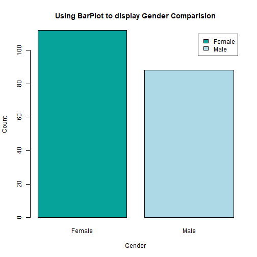

```r
percent <- round(a/sum(a)*100)
labels <- paste(c("Female","Male")," ",percent,"%",sep=" ")

#library(plotrix)
pie3D(a, labels = labels, main="Pie Chart Depicting Ratio of Female and Male",
      col=c("#05a399", "lightblue"))
```

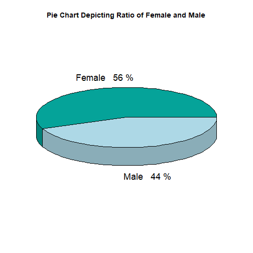

### Visualization of age distribution


```r
hist(customer_data$Age, col = "steelblue", 
     main="Histogram to Show Count of Age Class",
     xlab="Age Class",
     ylab="Frequency",
     labels=TRUE)
```

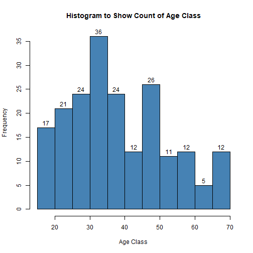

```r
boxplot(customer_data$Age, col="steelblue",
        main="Boxplot for Descriptive Analysis of Age")
```

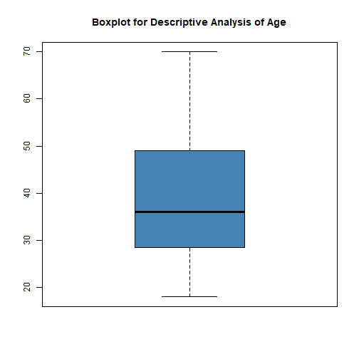

###  Analysis of the Annual Income of the Customers


```r
summary(customer_data$Annual.Income..k..)
```

```
##    Min. 1st Qu.  Median    Mean 3rd Qu.    Max. 
##   15.00   41.50   61.50   60.56   78.00  137.00
```

```r
# Histogram of annual income 
hist(customer_data$Annual.Income..k..,
     main="Histogram for Annual Income",
     xlab="Annual Income Class",
     ylab="Frequency",
     col="steelblue",
     labels=TRUE)
```

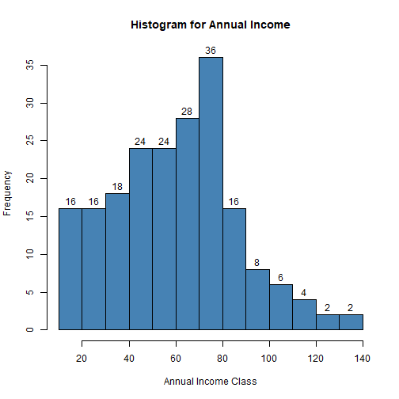

```r
# Density plot
plot(density(customer_data$Annual.Income..k..),
     main="Density Plot for Annual Income",
     xlab="Annual Income Class",
     ylab="Density",
     col="steelblue")

polygon(density(customer_data$Annual.Income..k..), col="steelblue")
```

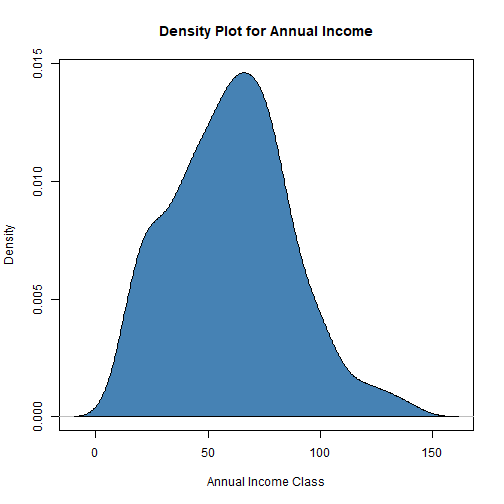

### Analyzing Spending Score of the Customers


```r
summary(customer_data$Spending.Score..1.100.)
```

```
##    Min. 1st Qu.  Median    Mean 3rd Qu.    Max. 
##    1.00   34.75   50.00   50.20   73.00   99.00
```

```r
# boxplot
boxplot(customer_data$Spending.Score..1.100.,
        horizontal=TRUE, col="steelblue",
        main="BoxPlot for Descriptive Analysis of Spending Score")
```

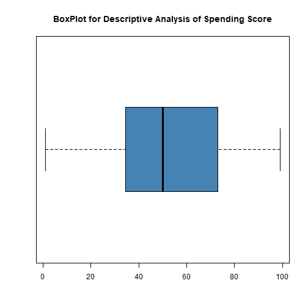

```r
# histogram
hist(customer_data$Spending.Score..1.100.,
     main="HistoGram for Spending Score",
     xlab="Spending Score Class",
     ylab="Frequency",
     col="steelblue",
     labels=TRUE)
```

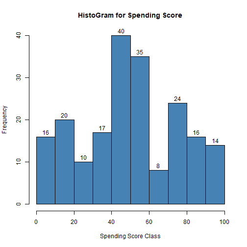


### K-means Algorithm

While using the k-means clustering algorithm, the first step is to indicate the number of clusters (k) that we wish to produce in the final output. The algorithm starts by selecting k objects from dataset randomly that will serve as the initial centers for our clusters. These selected objects are the cluster means, also known as centroids. Then, the remaining objects have an assignment of the closest centroid. This centroid is defined by the Euclidean Distance present between the object and the cluster mean. We refer to this step as “cluster assignment”. When the assignment is complete, the algorithm proceeds to calculate new mean value of each cluster present in the data. After the recalculation of the centers, the observations are checked if they are closer to a different cluster. Using the updated cluster mean, the objects undergo reassignment. This goes on repeatedly through several iterations until the cluster assignments stop altering. The clusters that are present in the current iteration are the same as the ones obtained in the previous iteration.

### Determining Optimal Clusters

Elbow Method


```r
library("purrr")
set.seed(321)
# function to calculate total intra-cluster sum of square 
iss <- function(k){
        kmeans(customer_data[,3:5], k,iter.max = 100, nstart = 100, 
               algorithm = "Lloyd")$tot.withinss
}
k.values <- 1:10
iss_values <- map_dbl(k.values,iss)

plot(k.values, iss_values,
     type="b", pch = 19, frame = FALSE, 
     xlab="Number of clusters K",
     ylab="Total intra-clusters sum of squares")
```

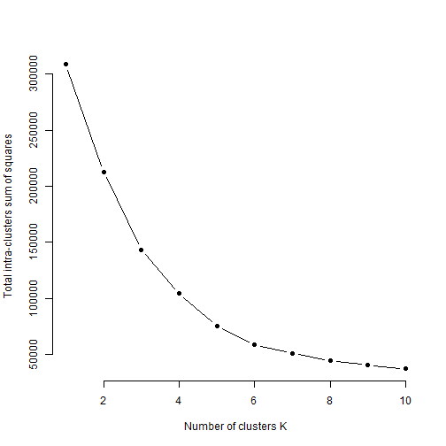

Average Silhouette Method


```r
#library(cluster)
#library(gridExtra)
#library(grid)

k2<-kmeans(customer_data[,3:5],2,iter.max=100,nstart=50,algorithm="Lloyd")
s2<-plot(silhouette(k2$cluster,dist(customer_data[,3:5],"euclidean")))
```

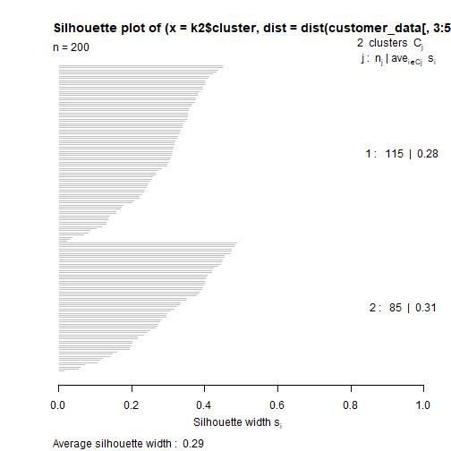

```r
k3<-kmeans(customer_data[,3:5],3,iter.max=100,nstart=50,algorithm="Lloyd")
s3<-plot(silhouette(k3$cluster,dist(customer_data[,3:5],"euclidean")))
```

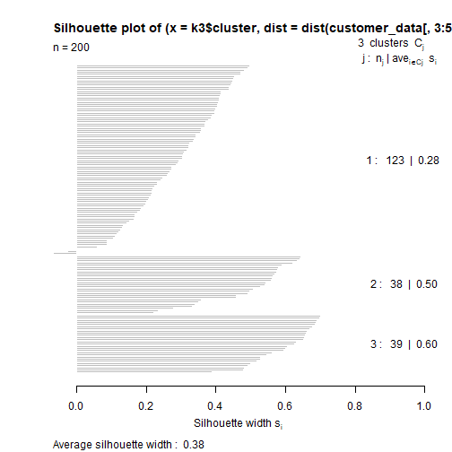

```r
k4<-kmeans(customer_data[,3:5],4,iter.max=100,nstart=50,algorithm="Lloyd")
s4<-plot(silhouette(k4$cluster,dist(customer_data[,3:5],"euclidean")))
```

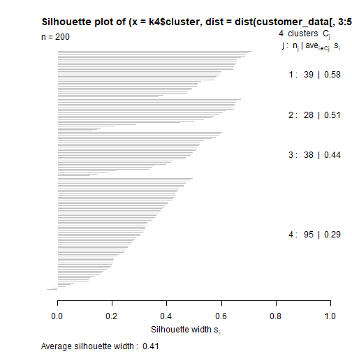

```r
k5<-kmeans(customer_data[,3:5],5,iter.max=100,nstart=50,algorithm="Lloyd")
s5<-plot(silhouette(k5$cluster,dist(customer_data[,3:5],"euclidean")))
```

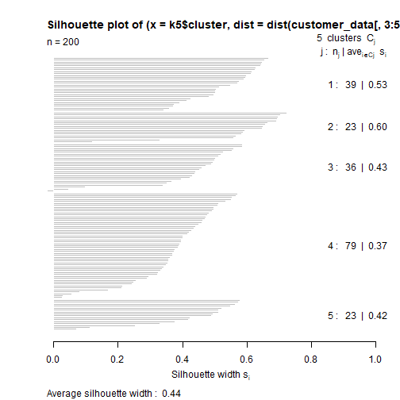

```r
k6<-kmeans(customer_data[,3:5],6,iter.max=100,nstart=50,algorithm="Lloyd")
s6<-plot(silhouette(k6$cluster,dist(customer_data[,3:5],"euclidean")))
```

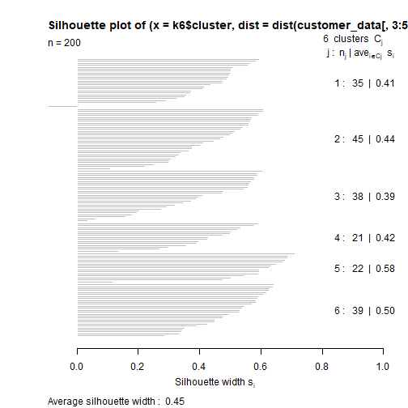

```r
k7<-kmeans(customer_data[,3:5],7,iter.max=100,nstart=50,algorithm="Lloyd")
s7<-plot(silhouette(k7$cluster,dist(customer_data[,3:5],"euclidean")))
```

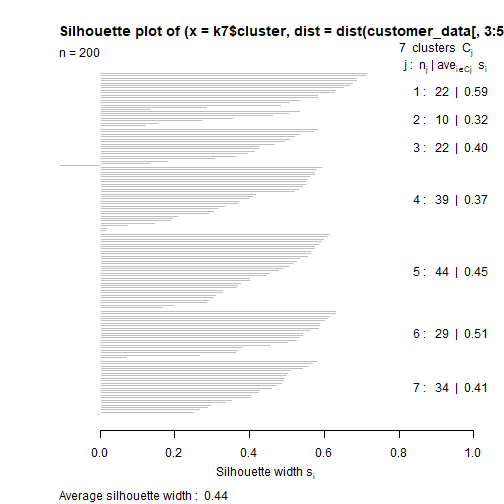

```r
k8<-kmeans(customer_data[,3:5],8,iter.max=100,nstart=50,algorithm="Lloyd")
s8<-plot(silhouette(k8$cluster,dist(customer_data[,3:5],"euclidean")))
```

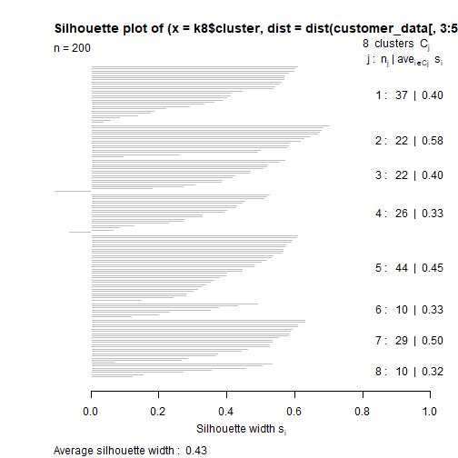

```r
k9<-kmeans(customer_data[,3:5],9,iter.max=100,nstart=50,algorithm="Lloyd")
s9<-plot(silhouette(k9$cluster,dist(customer_data[,3:5],"euclidean")))
```

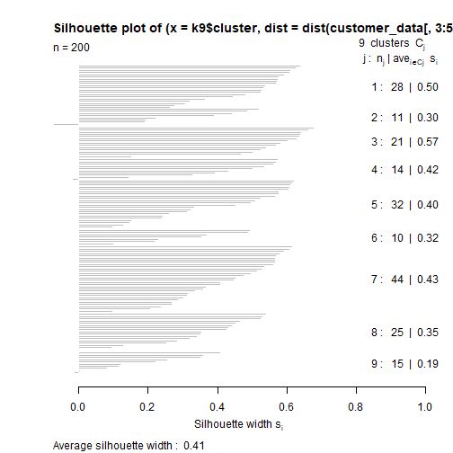

```r
k10<-kmeans(customer_data[,3:5],10,iter.max=100,nstart=50,algorithm="Lloyd")
s10<-plot(silhouette(k10$cluster,dist(customer_data[,3:5],"euclidean")))
```

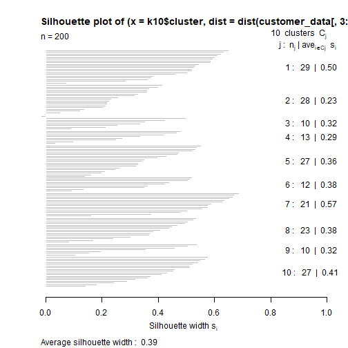

```r
# we make use of the fviz_nbclust() function to determine 
# and visualize the optimal number of clusters

#library(NbClust)
#library(factoextra)

fviz_nbclust(customer_data[,3:5], kmeans, method = "silhouette")
```

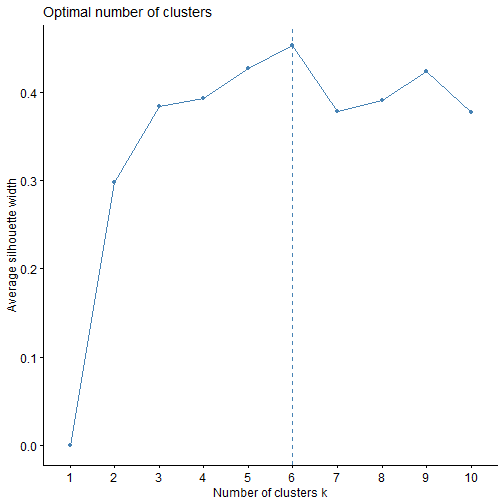

Gap Statistic Method


```r
set.seed(125)
stat_gap <- clusGap(customer_data[,3:5], FUN = kmeans, nstart = 25,
                    K.max = 10, B = 50)
```

```
## Clustering k = 1,2,..., K.max (= 10): .. done
## Bootstrapping, b = 1,2,..., B (= 50)  [one "." per sample]:
## .................................................. 50
```

```r
fviz_gap_stat(stat_gap)
```

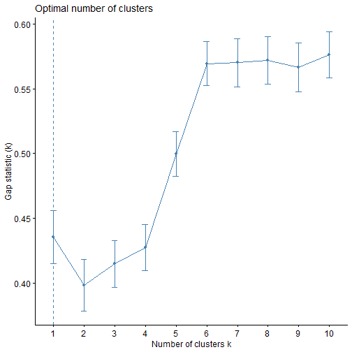

```r
# let us take k = 6 as our optimal cluster
k6<-kmeans(customer_data[,3:5],6,iter.max=100,nstart=50,algorithm="Lloyd")
k6
```

```
## K-means clustering with 6 clusters of sizes 45, 22, 21, 38, 35, 39
## 
## Cluster means:
##        Age Annual.Income..k.. Spending.Score..1.100.
## 1 56.15556           53.37778               49.08889
## 2 25.27273           25.72727               79.36364
## 3 44.14286           25.14286               19.52381
## 4 27.00000           56.65789               49.13158
## 5 41.68571           88.22857               17.28571
## 6 32.69231           86.53846               82.12821
## 
## Clustering vector:
##   [1] 3 2 3 2 3 2 3 2 3 2 3 2 3 2 3 2 3 2 3 2 3 2 3 2 3 2 3 2 3 2 3 2 3 2 3 2 3 2 3
##  [40] 2 1 2 1 4 3 2 1 4 4 4 1 4 4 1 1 1 1 1 4 1 1 4 1 1 1 4 1 1 4 4 1 1 1 1 1 4 1 4
##  [79] 4 1 1 4 1 1 4 1 1 4 4 1 1 4 1 4 4 4 1 4 1 4 4 1 1 4 1 4 1 1 1 1 1 4 4 4 4 4 1
## [118] 1 1 1 4 4 4 6 4 6 5 6 5 6 5 6 4 6 5 6 5 6 5 6 5 6 4 6 5 6 5 6 5 6 5 6 5 6 5 6
## [157] 5 6 5 6 5 6 5 6 5 6 5 6 5 6 5 6 5 6 5 6 5 6 5 6 5 6 5 6 5 6 5 6 5 6 5 6 5 6 5
## [196] 6 5 6 5 6
## 
## Within cluster sum of squares by cluster:
## [1]  8062.133  4099.818  7732.381  7742.895 16690.857 13972.359
##  (between_SS / total_SS =  81.1 %)
## 
## Available components:
## 
## [1] "cluster"      "centers"      "totss"        "withinss"     "tot.withinss"
## [6] "betweenss"    "size"         "iter"         "ifault"
```

```r
# cluster - This is a vector of several integers that denote the cluster which has an allocation of each point.
# totss - This represents the total sum of squares.
# centers - Matrix comprising of several cluster centers
# withinss - This is a vector representing the intra-cluster sum of squares having one component per cluster.
# tot.withinss - This denotes the total intra-cluster sum of squares.
# betweenss - This is the sum of between-cluster squares.
# size - The total number of points that each cluster holds.


## Visualizing the Clustering Results using the First Two Principle Components

pcclust=prcomp(customer_data[,3:5],scale=FALSE) #principal component analysis
summary(pcclust)
```

```
## Importance of components:
##                            PC1     PC2     PC3
## Standard deviation     26.4625 26.1597 12.9317
## Proportion of Variance  0.4512  0.4410  0.1078
## Cumulative Proportion   0.4512  0.8922  1.0000
```

```r
pcclust$rotation[,1:2] 
```

```
##                               PC1        PC2
## Age                     0.1889742 -0.1309652
## Annual.Income..k..     -0.5886410 -0.8083757
## Spending.Score..1.100. -0.7859965  0.5739136
```

```r
# visualize the clusters
set.seed(147)
ggplot(customer_data, aes(x =Annual.Income..k.., y = Spending.Score..1.100.)) + 
        geom_point(stat = "identity", aes(color = as.factor(k6$cluster))) +
        scale_color_discrete(name=" ",
                             breaks=c("1", "2", "3", "4", "5", "6"),
                             labels=c("Cluster 1", "Cluster 2", "Cluster 3", 
                                      "Cluster 4", "Cluster 5","Cluster 6")) +
        ggtitle("Segments of Mall Customers", subtitle = "Using K-means Clustering")
```

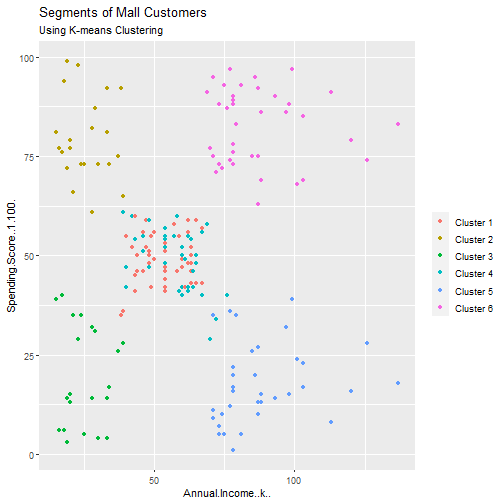

```r
kCols=function(vec){cols=rainbow (length (unique (vec)))
return (cols[as.numeric(as.factor(vec))])}

digCluster<-k6$cluster
dignm<-as.character(digCluster)         # K-means clusters

plot(pcclust$x[,1:2], col =kCols(digCluster),pch =19,xlab ="K-means",ylab="classes")
legend("bottomleft",unique(dignm),fill=unique(kCols(digCluster)))
```

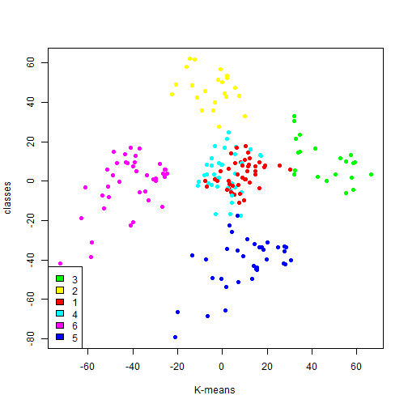


