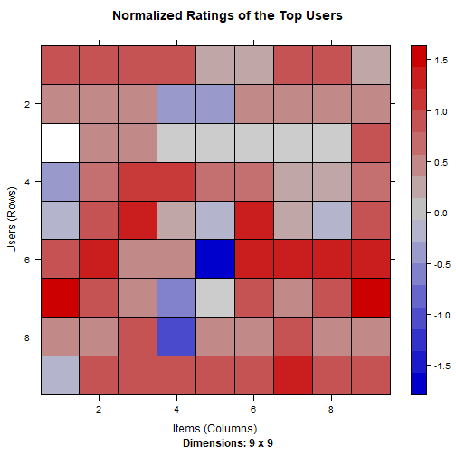

### What is a Recommendation System?

A recommendation system provides suggestions to the users through a filtering process that is based on user preferences and browsing history. The information about the user is taken as an input. The information is taken from the input that is in the form of browsing data. This information reflects the prior usage of the product as well as the assigned ratings. A recommendation system is a platform that provides its users with various contents based on their preferences and likings. A recommendation system takes the information about the user as an input. The recommendation system is an implementation of the machine learning algorithms.

### Loading Packages


```r
library(recommenderlab)
library(ggplot2)
library(data.table)
library(reshape2)
```

### Importing the data


```r
setwd("E:/R/Projects/Movie Recommendation System")
movie_data <- read.csv("./IMDB-dataset/movies.csv")
rating_data <- read.csv("./IMDB-dataset/ratings.csv")

head(movie_data)
```

```
##   movieId                              title
## 1       1                   Toy Story (1995)
## 2       2                     Jumanji (1995)
## 3       3            Grumpier Old Men (1995)
## 4       4           Waiting to Exhale (1995)
## 5       5 Father of the Bride Part II (1995)
## 6       6                        Heat (1995)
##                                        genres
## 1 Adventure|Animation|Children|Comedy|Fantasy
## 2                  Adventure|Children|Fantasy
## 3                              Comedy|Romance
## 4                        Comedy|Drama|Romance
## 5                                      Comedy
## 6                       Action|Crime|Thriller
```

```r
summary(movie_data)
```

```
##     movieId          title              genres         
##  Min.   :     1   Length:10329       Length:10329      
##  1st Qu.:  3240   Class :character   Class :character  
##  Median :  7088   Mode  :character   Mode  :character  
##  Mean   : 31924                                        
##  3rd Qu.: 59900                                        
##  Max.   :149532
```

```r
head(rating_data)
```

```
##   userId movieId rating  timestamp
## 1      1      16    4.0 1217897793
## 2      1      24    1.5 1217895807
## 3      1      32    4.0 1217896246
## 4      1      47    4.0 1217896556
## 5      1      50    4.0 1217896523
## 6      1     110    4.0 1217896150
```

```r
summary(rating_data)
```

```
##      userId         movieId           rating        timestamp        
##  Min.   :  1.0   Min.   :     1   Min.   :0.500   Min.   :8.286e+08  
##  1st Qu.:192.0   1st Qu.:  1073   1st Qu.:3.000   1st Qu.:9.711e+08  
##  Median :383.0   Median :  2497   Median :3.500   Median :1.115e+09  
##  Mean   :364.9   Mean   : 13381   Mean   :3.517   Mean   :1.130e+09  
##  3rd Qu.:557.0   3rd Qu.:  5991   3rd Qu.:4.000   3rd Qu.:1.275e+09  
##  Max.   :668.0   Max.   :149532   Max.   :5.000   Max.   :1.452e+09
```

### Data pre-processing


```r
movie_genre <- as.data.frame(movie_data$genres, stringsAsFactors = FALSE)
movie_genre2 <- as.data.frame(tstrsplit(movie_genre[,1], "[|]", type.convert = TRUE), 
                              stringsAsFactors = FALSE)
colnames(movie_genre2) <- c(1:10)

list_genre <- c("Action", "Adventure", "Animation", "Children", 
                "Comedy", "Crime","Documentary", "Drama", "Fantasy",
                "Film-Noir", "Horror", "Musical", "Mystery","Romance",
                "Sci-Fi", "Thriller", "War", "Western")

genre_mat1 <- matrix(0, 10330, 18)
genre_mat1[1,] <- list_genre
colnames(genre_mat1) <- list_genre

for(index in 1:nrow(movie_genre2)){
    for(col in 1:ncol(movie_genre2)){
        gen_col <- which(genre_mat1[1,] == movie_genre2[index, col])
        genre_mat1[index+1,gen_col] <- 1
    }
}
head(genre_mat1)
```

```
##      Action   Adventure   Animation   Children   Comedy   Crime   Documentary  
## [1,] "Action" "Adventure" "Animation" "Children" "Comedy" "Crime" "Documentary"
## [2,] "0"      "1"         "1"         "1"        "1"      "0"     "0"          
## [3,] "0"      "1"         "0"         "1"        "0"      "0"     "0"          
## [4,] "0"      "0"         "0"         "0"        "1"      "0"     "0"          
## [5,] "0"      "0"         "0"         "0"        "1"      "0"     "0"          
## [6,] "0"      "0"         "0"         "0"        "1"      "0"     "0"          
##      Drama   Fantasy   Film-Noir   Horror   Musical   Mystery   Romance  
## [1,] "Drama" "Fantasy" "Film-Noir" "Horror" "Musical" "Mystery" "Romance"
## [2,] "0"     "1"       "0"         "0"      "0"       "0"       "0"      
## [3,] "0"     "1"       "0"         "0"      "0"       "0"       "0"      
## [4,] "0"     "0"       "0"         "0"      "0"       "0"       "1"      
## [5,] "1"     "0"       "0"         "0"      "0"       "0"       "1"      
## [6,] "0"     "0"       "0"         "0"      "0"       "0"       "0"      
##      Sci-Fi   Thriller   War   Western  
## [1,] "Sci-Fi" "Thriller" "War" "Western"
## [2,] "0"      "0"        "0"   "0"      
## [3,] "0"      "0"        "0"   "0"      
## [4,] "0"      "0"        "0"   "0"      
## [5,] "0"      "0"        "0"   "0"      
## [6,] "0"      "0"        "0"   "0"
```

```r
# remove first row
genre_mat2 <- as.data.frame(genre_mat1[-1,], stringsAsFactors = FALSE)
head(genre_mat2)
```

```
##   Action Adventure Animation Children Comedy Crime Documentary Drama Fantasy
## 1      0         1         1        1      1     0           0     0       1
## 2      0         1         0        1      0     0           0     0       1
## 3      0         0         0        0      1     0           0     0       0
## 4      0         0         0        0      1     0           0     1       0
## 5      0         0         0        0      1     0           0     0       0
## 6      1         0         0        0      0     1           0     0       0
##   Film-Noir Horror Musical Mystery Romance Sci-Fi Thriller War Western
## 1         0      0       0       0       0      0        0   0       0
## 2         0      0       0       0       0      0        0   0       0
## 3         0      0       0       0       1      0        0   0       0
## 4         0      0       0       0       1      0        0   0       0
## 5         0      0       0       0       0      0        0   0       0
## 6         0      0       0       0       0      0        1   0       0
```

```r
# convert from characters to integers
for(col in 1:ncol(genre_mat2)){
    genre_mat2[,col] <- as.integer(genre_mat2[,col])
}

str(genre_mat2)
```

```
## 'data.frame':	10329 obs. of  18 variables:
##  $ Action     : int  0 0 0 0 0 1 0 0 1 1 ...
##  $ Adventure  : int  1 1 0 0 0 0 0 1 0 1 ...
##  $ Animation  : int  1 0 0 0 0 0 0 0 0 0 ...
##  $ Children   : int  1 1 0 0 0 0 0 1 0 0 ...
##  $ Comedy     : int  1 0 1 1 1 0 1 0 0 0 ...
##  $ Crime      : int  0 0 0 0 0 1 0 0 0 0 ...
##  $ Documentary: int  0 0 0 0 0 0 0 0 0 0 ...
##  $ Drama      : int  0 0 0 1 0 0 0 0 0 0 ...
##  $ Fantasy    : int  1 1 0 0 0 0 0 0 0 0 ...
##  $ Film-Noir  : int  0 0 0 0 0 0 0 0 0 0 ...
##  $ Horror     : int  0 0 0 0 0 0 0 0 0 0 ...
##  $ Musical    : int  0 0 0 0 0 0 0 0 0 0 ...
##  $ Mystery    : int  0 0 0 0 0 0 0 0 0 0 ...
##  $ Romance    : int  0 0 1 1 0 0 1 0 0 0 ...
##  $ Sci-Fi     : int  0 0 0 0 0 0 0 0 0 0 ...
##  $ Thriller   : int  0 0 0 0 0 1 0 0 0 1 ...
##  $ War        : int  0 0 0 0 0 0 0 0 0 0 ...
##  $ Western    : int  0 0 0 0 0 0 0 0 0 0 ...
```

Create a 'search matrix' that will allow us to perform an easy search of the films by specifying the genre present in our list.


```r
searchMatrix <- cbind(movie_data[,1:2], genre_mat2)
head(searchMatrix)
```

```
##   movieId                              title Action Adventure Animation Children
## 1       1                   Toy Story (1995)      0         1         1        1
## 2       2                     Jumanji (1995)      0         1         0        1
## 3       3            Grumpier Old Men (1995)      0         0         0        0
## 4       4           Waiting to Exhale (1995)      0         0         0        0
## 5       5 Father of the Bride Part II (1995)      0         0         0        0
## 6       6                        Heat (1995)      1         0         0        0
##   Comedy Crime Documentary Drama Fantasy Film-Noir Horror Musical Mystery Romance
## 1      1     0           0     0       1         0      0       0       0       0
## 2      0     0           0     0       1         0      0       0       0       0
## 3      1     0           0     0       0         0      0       0       0       1
## 4      1     0           0     1       0         0      0       0       0       1
## 5      1     0           0     0       0         0      0       0       0       0
## 6      0     1           0     0       0         0      0       0       0       0
##   Sci-Fi Thriller War Western
## 1      0        0   0       0
## 2      0        0   0       0
## 3      0        0   0       0
## 4      0        0   0       0
## 5      0        0   0       0
## 6      0        1   0       0
```

For our movie recommendation system to make sense of our ratings through recommenderlabs, we have to convert our matrix into a sparse matrix one. This new matrix is of the class ‘realRatingMatrix’. This is performed as follows:


```r
rating_matrix <- dcast(rating_data, userId~movieId, value.var = "rating", na.rm = F)
View(rating_matrix)

# removing user id's
rating_matrix <- as.matrix(rating_matrix[,-1])
View(rating_matrix)

# converting rating matrix into a recommenderlab sparse matrix
rating_matrix <- as(rating_matrix, "realRatingMatrix")
rating_matrix
```

```
## 668 x 10325 rating matrix of class 'realRatingMatrix' with 105339 ratings.
```

Overview of some of the important parameters that provide us various options for building recommendation systems for movies.


```r
recommendation_model <- recommenderRegistry$get_entries(dataType = "realRatingMatrix")
names(recommendation_model)
```

```
##  [1] "HYBRID_realRatingMatrix"       "ALS_realRatingMatrix"         
##  [3] "ALS_implicit_realRatingMatrix" "IBCF_realRatingMatrix"        
##  [5] "LIBMF_realRatingMatrix"        "POPULAR_realRatingMatrix"     
##  [7] "RANDOM_realRatingMatrix"       "RERECOMMEND_realRatingMatrix" 
##  [9] "SVD_realRatingMatrix"          "SVDF_realRatingMatrix"        
## [11] "UBCF_realRatingMatrix"
```

```r
lapply(recommendation_model, "[[", "description")
```

```
## $HYBRID_realRatingMatrix
## [1] "Hybrid recommender that aggegates several recommendation strategies using weighted averages."
## 
## $ALS_realRatingMatrix
## [1] "Recommender for explicit ratings based on latent factors, calculated by alternating least squares algorithm."
## 
## $ALS_implicit_realRatingMatrix
## [1] "Recommender for implicit data based on latent factors, calculated by alternating least squares algorithm."
## 
## $IBCF_realRatingMatrix
## [1] "Recommender based on item-based collaborative filtering."
## 
## $LIBMF_realRatingMatrix
## [1] "Matrix factorization with LIBMF via package recosystem (https://cran.r-project.org/web/packages/recosystem/vignettes/introduction.html)."
## 
## $POPULAR_realRatingMatrix
## [1] "Recommender based on item popularity."
## 
## $RANDOM_realRatingMatrix
## [1] "Produce random recommendations (real ratings)."
## 
## $RERECOMMEND_realRatingMatrix
## [1] "Re-recommends highly rated items (real ratings)."
## 
## $SVD_realRatingMatrix
## [1] "Recommender based on SVD approximation with column-mean imputation."
## 
## $SVDF_realRatingMatrix
## [1] "Recommender based on Funk SVD with gradient descend (https://sifter.org/~simon/journal/20061211.html)."
## 
## $UBCF_realRatingMatrix
## [1] "Recommender based on user-based collaborative filtering."
```

Implementing a single model in our R project - Item Based Collaborative Filtering


```r
recommendation_model$IBCF_realRatingMatrix$parameters
```

```
## $k
## [1] 30
## 
## $method
## [1] "Cosine"
## 
## $normalize
## [1] "center"
## 
## $normalize_sim_matrix
## [1] FALSE
## 
## $alpha
## [1] 0.5
## 
## $na_as_zero
## [1] FALSE
```


### Exploring similar data

Collaborative Filtering involves suggesting movies to the users that are based on collecting preferences from many other users. For example, if a user A likes to watch action films and so does user B, then the movies that the user B will watch in the future will be recommended to A and vice-versa. Therefore, recommending movies is dependent on creating a relationship of similarity between the two users. With the help of recommenderlab, we can compute similarities using various operators like cosine, pearson as well as jaccard.


```r
similarity_matrix <- similarity(rating_matrix[1:4,], method = "cosine", which = "users")
as.matrix(similarity_matrix)
```

```
##           1         2         3         4
## 1 0.0000000 0.9760860 0.9641723 0.9914398
## 2 0.9760860 0.0000000 0.9925732 0.9374253
## 3 0.9641723 0.9925732 0.0000000 0.9888968
## 4 0.9914398 0.9374253 0.9888968 0.0000000
```

```r
image(as.matrix(similarity_matrix), main = "User's Similarities")
```


Similarity that is shared between the films.


```r
movie_similarity <- similarity(rating_matrix[, 1:4], method = "cosine", which = "items")
as.matrix(movie_similarity)
```

```
##           1         2         3         4
## 1 0.0000000 0.9669732 0.9559341 0.9101276
## 2 0.9669732 0.0000000 0.9658757 0.9412416
## 3 0.9559341 0.9658757 0.0000000 0.9864877
## 4 0.9101276 0.9412416 0.9864877 0.0000000
```

```r
image(as.matrix(movie_similarity), main = "Movies similarity")
```


Extracting the most unique ratings.


```r
rating_values <- as.vector(rating_matrix@data)
#rating_values
unique(rating_values)
```

```
##  [1] 0.0 5.0 4.0 3.0 4.5 1.5 2.0 3.5 1.0 2.5 0.5
```

table of ratings that will display the most unique ratings.


```r
table(rating_values)
```

```
## rating_values
##       0     0.5       1     1.5       2     2.5       3     3.5       4     4.5 
## 6791761    1198    3258    1567    7943    5484   21729   12237   28880    8187 
##       5 
##   14856
```


### Most viewed movies - Visualization


```r
#count views for each movie
movie_views <- colCounts(rating_matrix)

# create data frame of views
table_views <- data.frame(movie = names(movie_views), views = movie_views)

# sort by no. of views
table_views <- table_views[order(table_views$views, decreasing = TRUE), ]
table_views$title <- NA

for(index in 1:10325){
    table_views[index, 3] = subset(movie_data, 
                                   movie_data$movieId == table_views[index,1])$title
}
table_views[1:6,]
```

```
##     movie views                                     title
## 296   296   325                       Pulp Fiction (1994)
## 356   356   311                       Forrest Gump (1994)
## 318   318   308          Shawshank Redemption, The (1994)
## 480   480   294                      Jurassic Park (1993)
## 593   593   290          Silence of the Lambs, The (1991)
## 260   260   273 Star Wars: Episode IV - A New Hope (1977)
```

A bar plot for the total number of views of the top films.


```r
ggplot(table_views[1:6, ], aes(x = title, y = views)) +
    geom_bar(stat="identity", fill = 'steelblue') +
    geom_text(aes(label=views), vjust=-0.3, size=3.5) +
    theme(axis.text.x = element_text(angle = 45, hjust = 1)) +
    ggtitle("Total Views of the Top Films")
```


Heatmap of Movie Ratings


```r
image(rating_matrix[1:20, 1:25], axes = FALSE, 
      main = "Heatmap of the first 20 rows and 25 columns")
```


### Performing Data Preparation

We will conduct data preparation in the following three steps –

- Selecting useful data.
- Normalizing data.
- Binarizing the data.

We have set the threshold for the minimum number of users who have rated a film as 50 and minumum of 50 views per film.


```r
movie_ratings <- rating_matrix[rowCounts(rating_matrix) > 50,
                              colCounts(rating_matrix) > 50]
movie_ratings     # 420 users and 447 films
```

```
## 420 x 447 rating matrix of class 'realRatingMatrix' with 38341 ratings.
```

We can now delineate our matrix of relevant users as follows.


```r
minimum_movies <- quantile(rowCounts(movie_ratings), 0.98)
minimum_users <- quantile(colCounts(movie_ratings), 0.98)
image(movie_ratings[rowCounts(movie_ratings) > minimum_movies,
                    colCounts(movie_ratings) > minimum_users],
      main = "Heatmap of the top users and movies")
```


Visualization of the distribution of the average ratings per user


```r
average_ratings <- rowMeans(movie_ratings)
qplot(average_ratings, fill = I("steelblue"), col = I("red")) +
    ggtitle("Distribution of the average rating per user")
```


### Data Normalization

In the case of some users, there can be high ratings or low ratings provided to all of the watched films. This will act as a bias while implementing our model. In order to remove this, we normalize our data. Normalization is a data preparation procedure to standardize the numerical values in a column to a common scale value. This is done in such a way that there is no distortion in the range of values. Normalization transforms the average value of our ratings column to 0. We then plot a heatmap that delineates our normalized ratings.


```r
normalized_ratings <- normalize(movie_ratings)
sum(rowMeans(normalized_ratings) > 0.00001)
```

```
## [1] 0
```

```r
image(normalized_ratings[rowCounts(normalized_ratings) > minimum_movies,
                         colCounts(normalized_ratings) > minimum_users],
      main = "Normalized Ratings of the Top Users")
```




### Performing Data Binarization

Binarizing the data means that we have two discrete values 1 and 0, which will allow our recommendation systems to work more efficiently. We will define a matrix that will consist of 1 if the rating is above 3 and otherwise it will be 0.


```r
binary_minimum_movies <- quantile(rowCounts(movie_ratings), 0.95)
binary_minimum_users <- quantile(colCounts(movie_ratings), 0.95)

good_rated_films <- binarize(movie_ratings, minRating = 3)
image(good_rated_films[rowCounts(movie_ratings) > binary_minimum_movies,
                       colCounts(movie_ratings) > binary_minimum_users],
      main = "Heatmap of the top users and movies")
```


### Collabrative Filtering System

We will develop our very own Item Based Collaborative Filtering System. This type of collaborative filtering finds similarity in the items based on the people’s ratings of them. The algorithm first builds a similar-items table of the customers who have purchased them into a combination of similar items. This is then fed into the recommendation system.

Splitting the dataset into 80% training set and 20% test set


```r
sampled_data<- sample(x = c(TRUE, FALSE),
                      size = nrow(movie_ratings),
                      replace = TRUE,
                      prob = c(0.8, 0.2))
training_data <- movie_ratings[sampled_data, ]
testing_data <- movie_ratings[!sampled_data, ]
```

Building the Recommendation System using R


```r
recommendation_system <- recommenderRegistry$get_entries(dataType ="realRatingMatrix")
recommendation_system$IBCF_realRatingMatrix$parameters
```

```
## $k
## [1] 30
## 
## $method
## [1] "Cosine"
## 
## $normalize
## [1] "center"
## 
## $normalize_sim_matrix
## [1] FALSE
## 
## $alpha
## [1] 0.5
## 
## $na_as_zero
## [1] FALSE
```

```r
recommen_model <- Recommender(data = training_data,
                              method = "IBCF",
                              parameter = list(k = 30))
recommen_model
```

```
## Recommender of type 'IBCF' for 'realRatingMatrix' 
## learned using 316 users.
```

```r
class(recommen_model)
```

```
## [1] "Recommender"
## attr(,"package")
## [1] "recommenderlab"
```

Using the getModel() function, we will retrieve the recommen_model. We will then find the class and dimensions of our similarity matrix that is contained within model_info.


```r
model_info <- getModel(recommen_model)
class(model_info$sim)
```

```
## [1] "dgCMatrix"
## attr(,"package")
## [1] "Matrix"
```

```r
dim(model_info$sim)
```

```
## [1] 447 447
```

```r
top_items <- 20
image(model_info$sim[1:top_items, 1:top_items],
      main = "Heatmap of the first rows and columns")
```


We will carry out the sum of rows and columns with the similarity of the objects above 0. We will visualize the sum of columns through a distribution as follows. 


```r
sum_rows <- rowSums(model_info$sim > 0)
table(sum_rows)
```

```
## sum_rows
##  30 
## 447
```

```r
sum_cols <- colSums(model_info$sim > 0)
qplot(sum_cols, fill=I("steelblue"), col=I("red")) + 
    ggtitle("Distribution of the column count")
```


We will create a top_recommendations variable which will be initialized to 10, specifying the number of films to each user. We will then use the predict() function that will identify similar items and will rank them appropriately. Here, each rating is used as a weight. Each weight is multiplied with related similarities.


```r
top_recommendations <- 10 # the number of items to recommend to each user
predicted_recommendations <- predict(object = recommen_model,
                                     newdata = testing_data,
                                     n = top_recommendations)
predicted_recommendations
```

```
## Recommendations as 'topNList' with n = 10 for 104 users.
```


```r
user1 <- predicted_recommendations@items[[1]] # recommendation for the first user
movies_user1 <- predicted_recommendations@itemLabels[user1]
movies_user2 <- movies_user1
for (index in 1:10){
    movies_user2[index] <- as.character(subset(movie_data,
                                               movie_data$movieId == movies_user1[index])$title)
}
movies_user2
```

```
##  [1] "Grumpier Old Men (1995)"            "Father of the Bride Part II (1995)"
##  [3] "From Dusk Till Dawn (1996)"         "Happy Gilmore (1996)"              
##  [5] "Taxi Driver (1976)"                 "Congo (1995)"                      
##  [7] "Desperado (1995)"                   "First Knight (1995)"               
##  [9] "Species (1995)"                     "Waterworld (1995)"
```


```r
recommendation_matrix <- sapply(predicted_recommendations@items,
                                function(x){ as.integer(colnames(movie_ratings)[x]) }) # matrix with the recommendations for each user
#dim(recc_matrix)
recommendation_matrix[,1:4]
```

```
##       [,1] [,2] [,3] [,4]
##  [1,]    3 1527 1408  364
##  [2,]    5 1247 5418 1073
##  [3,]   70    1  168 1080
##  [4,]  104    3   11 1278
##  [5,]  111   44 3751 1500
##  [6,]  160  145 1197 1625
##  [7,]  163  288 1278 2028
##  [8,]  168  442 6539 2078
##  [9,]  196  553 1088 2100
## [10,]  208  661   34 3114
```


