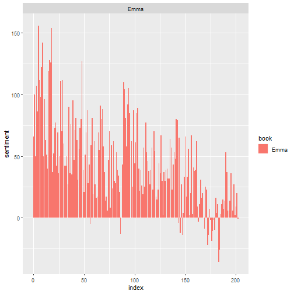
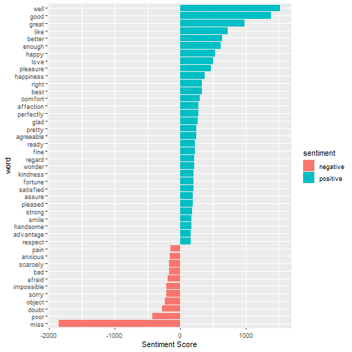
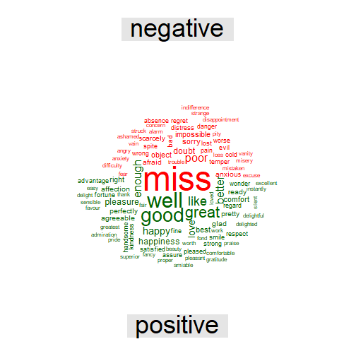

## R Project – Sentiment Analysis

The aim of this project is to build a sentiment analysis model which will allow us to categorize words based on their sentiments, that is whether they are positive, negative and also the magnitude of it. Before we start with our R project, let us understand sentiment analysis in detail.

### What is Sentiment Analysis?

Sentiment Analysis is a process of extracting opinions that have different polarities. By polarities, we mean positive, negative or neutral. It is also known as opinion mining and polarity detection. With the help of sentiment analysis, you can find out the nature of opinion that is reflected in documents, websites, social media feed, etc. Sentiment Analysis is a type of classification where the data is classified into different classes. These classes can be binary in nature (positive or negative) or, they can have multiple classes (happy, sad, angry, etc.).

We will make use of three general purpose lexicons like –

1. AFINN
2. bing
3. loughran

These three lexicons make use of the unigrams. Unigrams are a type of n-gram model that consists of a sequence of 1 item, that is, a word collected from a given textual data.

### Performing Sentiment Analysis with the Inner Join

The janeaustenr package will provide us with the textual data in the form of books authored by the novelist Jane Austen. Tidytext will allow us to perform efficient text analysis on our data. We will convert the text of our books into a tidy format using unnest_tokens() function.


```r
library(janeaustenr)
library(stringr)
library(tidytext)
library(dplyr)
library(tidyr)
library(ggplot2)
library(reshape2)
library(wordcloud)

tidy_data <- austen_books() %>%
    group_by(book) %>%
    mutate(linenumber = row_number(),
           chapter = cumsum(str_detect(text, regex("^chapter [\\divxlc]", 
                                                   ignore_case = TRUE)))) %>%
    ungroup() %>%
    unnest_tokens(word, text)
```

We have performed the tidy operation on our text such that each row contains a single word. We will now make use of the “bing” lexicon to and implement filter() over the words.


```r
positive_senti <- get_sentiments("bing") %>%
    filter(sentiment == "positive")

tidy_data %>% 
    filter(book == "Emma") %>%
    semi_join(positive_senti) %>%
    count(word, sort = TRUE)
```

```
## # A tibble: 668 x 2
##    word         n
##    <chr>    <int>
##  1 well       401
##  2 good       359
##  3 great      264
##  4 like       200
##  5 better     173
##  6 enough     129
##  7 happy      125
##  8 love       117
##  9 pleasure   115
## 10 right       92
## # ... with 658 more rows
```

We will use spread() function to segregate our data into separate columns of positive and negative sentiments.


```r
#library(tidyr)
bing <- get_sentiments("bing")
Emma_sentiment <- tidy_data %>% 
    inner_join(bing) %>%
    count(book = "Emma", index = linenumber %/% 80, sentiment) %>%
    spread(sentiment, n, fill = 0) %>%
    mutate(sentiment = positive - negative)
```

We will visualize the words present in the book “Emma” based on their corrosponding positive and negative scores.


```r
#library(ggplot2)
ggplot(Emma_sentiment, aes(index, sentiment, fill = book)) +
 geom_bar(stat = "identity", show.legend = TRUE) +
 facet_wrap(~book, ncol = 2, scales = "free_x")
```



Counting the most common positive and negative words that are present in the novel.


```r
counting_words <- tidy_data %>%
 inner_join(bing) %>%
 count(word, sentiment, sort = TRUE)
head(counting_words)
```

```
## # A tibble: 6 x 3
##   word   sentiment     n
##   <chr>  <chr>     <int>
## 1 miss   negative   1855
## 2 well   positive   1523
## 3 good   positive   1380
## 4 great  positive    981
## 5 like   positive    725
## 6 better positive    639
```

Visualization of our sentiment score


```r
counting_words %>%
 filter(n > 150) %>%
 mutate(n = ifelse(sentiment == "negative", -n, n)) %>%
 mutate(word = reorder(word, n)) %>%
 ggplot(aes(word, n, fill = sentiment))+
 geom_col() +
 coord_flip() +
 labs(y = "Sentiment Score")
```



In the final visualization, let us create a wordcloud that will delineate the most recurring positive and negative words.


```r
#library(reshape2)
#library(wordcloud)
tidy_data %>%
 inner_join(bing) %>%
 count(word, sentiment, sort = TRUE) %>%
 acast(word ~ sentiment, value.var = "n", fill = 0) %>%
 comparison.cloud(colors = c("red", "dark green"),
          max.words = 100)
```




