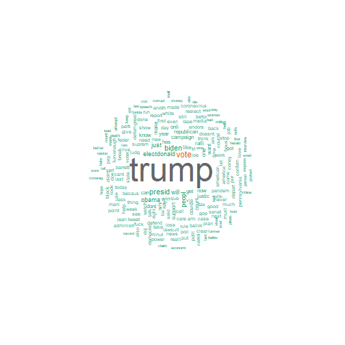
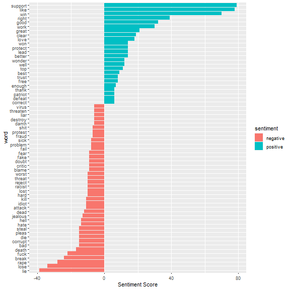

### Importing Packages


```r
rm(list=ls())
library(twitteR)
library(dplyr)
library(lubridate)
library(stringr)
library(tm)
library(SentimentAnalysis)
library(wordcloud)
library(wordcloud2)
library(syuzhet)
library(tidytext)
library(ggplot2)
```

### Connecting to Twitter API

Authenticate using your credentials to Twitter’s API by creating an access token.


```r
consumer_key <- "eAnyisrocHc70WM36lV19s4Oj"
consumer_secret <- "5zThdZxAybhOdypTpBtINtjC6O4c7NchPsb5f0MqHilBORluTt"
access_token <- "1319262410759237637-ro9T8KQCxSaHJrUqyBevO0Xyypbwx2"
access_secret <- "oWpZvc1wGUvi1LCh11kJchNeAtXcjMP853LCuFRZmmtXq"


setup_twitter_oauth(consumer_key, consumer_secret, 
                    access_token, access_secret)
```

```
## [1] "Using direct authentication"
```

### Extracting Tweets

I am extracting tweets for trump.


```r
tweets <- searchTwitter("Trump", n = 3000)
tweets_df <- twListToDF(tweets)

# seperating text column and converting text to character
tweets_text <- tweets_df$text

# Removing duplicate tweets
tweets_text_df <- data.frame(Text=unique(tweets_text))
```

### Data Cleaning

Once extraction of tweets is done, we come to the important step of data Cleansing and Corpus creation. This step is critical as it can make or break your data on which your modelling depends. Improper data cleansing can provide incorrect insights in sentimental analysis.  

Here is the order of cleaning tweets text.

1. First step in this is to remove URLS as it might get difficult to remove URLs after removing punctuation, numbers etc, as it disturbs the url text which prevents removing URLS. 
2. We'll remove strings between "<" and ">". This is to remove smileys and other encoded text. 
3. Remove retweet entities like @RT etc..
4. Remove quotes and apostrophe like India's, 'Guidance' etc..
5. Remove punctuation. This removes basic english punctuation.
6. Remove single letters like 's', 'a'
7. Remove unnecessary spaces.
8. Remove leading and trailing white spaces.


```r
## remove letters, digits, and punctuation haracters starting with @ 
## remove usernames and replace with ""
tweets_text_df$Text <- gsub("@\\w*"," ", tweets_text_df$Text)

##Remove website links and replace with ""
tweets_text_df$Text  <- gsub("http[[:alnum:][:punct:]]*"," ",
                          tolower(tweets_text_df$Text ))
tweets_text_df$Text  <- gsub("www[[:alnum:][:punct:]]*"," ",
                          tolower(tweets_text_df$Text ))


#remove html entitties like &quot; starting with 
#note perfect but we will remove remaining punctation at later step
tweets_text_df$Text<-gsub("\\&\\w*;","", tweets_text_df$Text)

#remove any letters repeated more than twice (eg. hellooooooo -> helloo)
tweets_text_df$Text  <- gsub('([[:alpha:]])\\1+', '\\1\\1', tweets_text_df$Text)

#additional cleaning removing leaving only letters numbers or spaces
tweets_text_df$Text <- gsub("[^a-zA-Z0-9 ]","",tweets_text_df$Text)
```

## Corpus Creation

Generally, first step in corpus creation is to convert text in to lower case. We did not want to lose Entity words like US(United States), IT(Information Technology) and other related keywords. If we convert to lower case, those will be lost in one of the corpus transformation steps like stemming, removing stop words etc. 

Apart from it, we almost done all basic corpus transformation steps required.

1. Stemming and correction/completion of words after stemming using a copy of corpus as
   dictionary.
2. Remove punctuations
3. Remove numbers
4. Remove stop words
5. Remove whitespaces


```r
# create corpus and clean up text before creating document term matrix
Twitter_Corpus <- Corpus(VectorSource(tweets_text_df$Text))

Twitter_Corpus <- tm_map(Twitter_Corpus, stemDocument)
Twitter_Corpus <- tm_map(Twitter_Corpus, removePunctuation)
Twitter_Corpus <- tm_map(Twitter_Corpus, removeNumbers)
Twitter_Corpus <- tm_map(Twitter_Corpus, removeWords, stopwords("english"))
Twitter_Corpus <- tm_map(Twitter_Corpus, stripWhitespace) 
```


## Term Document Matrix and Word Cloud


```r
#create term document matrix (terms as rows, documents as columns)
tdm <- TermDocumentMatrix(Twitter_Corpus)

# define tdm as matrix
m = as.matrix(tdm)
v <- sort(rowSums(m),decreasing=TRUE)
df <- data.frame(word = names(v),freq=v)

# word cloud
wordcloud(words = df$word, freq = df$freq, min.freq = 1,
          max.words=200, random.order=FALSE, rot.per=0.35,
          colors=brewer.pal(8, "Dark2"))
```



```r
#wordcloud2(df)
```


## plotting the graph of frequent terms


```r
barplot(df[1:10,]$freq, las = 2, names.arg = df[1:10,]$word,
        col ="steelblue", main ="Most frequent words",
        ylab = "Word frequencies")
```


## Sentiment Analysis

Perform sentiment analysis using the Bing lexicon and get_sentiments function from the tidytext package. There are many libraries, dictionaries and packages available in R to evaluate the emotion prevalent in a text. The tidytext and textdata packages have such word-to-emotion evaluation repositories. Three of the general purpose lexicons are Bing, AFINN and nrc (from the textdata package).


```r
mysentiment <- get_nrc_sentiment(df$word)
sentimentScores <- data.frame(Score= colSums(mysentiment))
sentimentScores <- cbind(Sentiment = rownames(sentimentScores), sentimentScores)
rownames(sentimentScores) <- NULL

# wordcloud2(sentimentScores)


positive_senti <- get_sentiments("bing") %>%
    filter(sentiment == "positive")

bing <- get_sentiments("bing")
df2 <- df %>% inner_join(bing)
df2 <- df2[-1,]

wordcloud2(df2)
```

```
## Error in file(con, "rb"): cannot open the connection
```


```r
# plot
df2 %>%
    filter(freq > 5) %>%
    mutate(n = ifelse(sentiment == "negative", -freq, freq)) %>%
    mutate(word = reorder(word, n)) %>%
    ggplot(aes(word, n, fill = sentiment))+
    geom_col() +
    coord_flip() +
    labs(y = "Sentiment Score")
```




