## Loading Packages


```r
library(ggplot2)
library(ggthemes)
library(lubridate)
library(dplyr)
library(tidyr)
library(DT)
library(scales)
```


```r
# Creating vectors of colors to be implemented in our plots
colors <- c("#CC1011", "#665555", "#05a399", "#cfcaca", "#f5e840", "#0683c9", "#e075b0")
```

## Reading the data


```r
apr_data <- read.csv("./data/uber-raw-data-apr14.csv")
may_data <- read.csv("./data/uber-raw-data-may14.csv")
jun_data <- read.csv("./data/uber-raw-data-jun14.csv")
jul_data <- read.csv("./data/uber-raw-data-jul14.csv")
aug_data <- read.csv("./data/uber-raw-data-aug14.csv")
sep_data <- read.csv("./data/uber-raw-data-sep14.csv")

data_2014 <- rbind(apr_data, may_data, jun_data, jul_data, aug_data, sep_data)

data_2014$Date.Time <- as.POSIXct(data_2014$Date.Time, format = "%m/%d/%Y %H:%M:%S")

data_2014$Time <- format(as.POSIXct(data_2014$Date.Time, format = "%m/%d/%Y %H:%H:%S"), 
                         format = "%H:%M:%S")

data_2014$Date.Time <- ymd_hms(data_2014$Date.Time)

data_2014$day <- factor(day(data_2014$Date.Time))
data_2014$month <- factor(month(data_2014$Date.Time, label = TRUE))
data_2014$year <- factor(year(data_2014$Date.Time))
data_2014$dayofweek <- factor(wday(data_2014$Date.Time, label = TRUE))

data_2014$hour <- factor(hour(hms(data_2014$Time)))
data_2014$minute <- factor(minute(hms(data_2014$Time)))
data_2014$second <- factor(second(hms(data_2014$Time)))
```


### Plots


```r
hour_data <- data_2014 %>% 
    group_by(hour) %>% 
    dplyr::summarize(Total = n())
datatable(hour_data)
```

```
## Error in file(con, "rb"): cannot open the connection
```

Trips every Hour


```r
ggplot(hour_data, aes(hour, Total)) +
    geom_bar(stat = "identity", fill = "steelblue") +
    ggtitle("Trips Every Hour") + 
    theme(legend.position = "none") +
    scale_y_continuous(labels = comma)
```

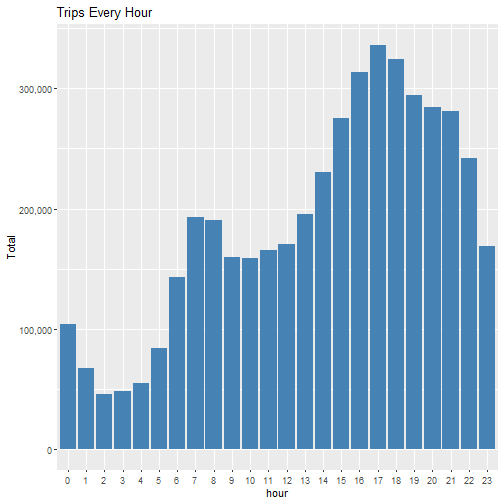

Trips by hour and month


```r
month_hour <- data_2014 %>% 
    group_by(month, hour) %>%
    dplyr::summarize(Total = n())

ggplot(month_hour, aes(hour, Total, fill = month)) +
    geom_bar(stat = "identity") +
    ggtitle("Trips by Hour and Month") +
    scale_y_continuous(labels = comma)
```

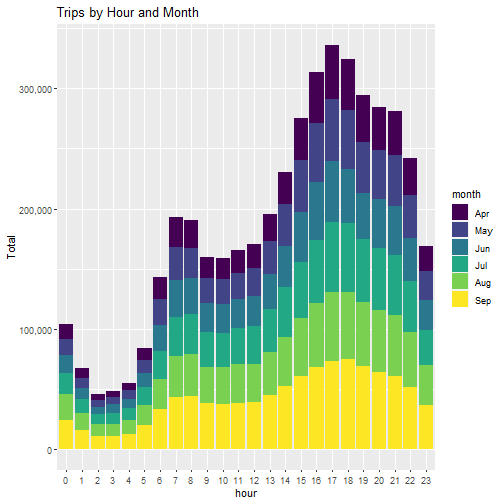


Trips during every day of the month


```r
day_group <- data_2014 %>%
    group_by(day) %>%
    dplyr::summarize(Total = n())
datatable(day_group)
```

```
## Error in file(con, "rb"): cannot open the connection
```

```r
ggplot(day_group, aes(day, Total)) +
    geom_bar(stat = "identity", fill = "steelblue") +
    ggtitle("Trips Every Day") +
    theme(legend.position = "none") +
    scale_y_continuous(labels = comma)
```

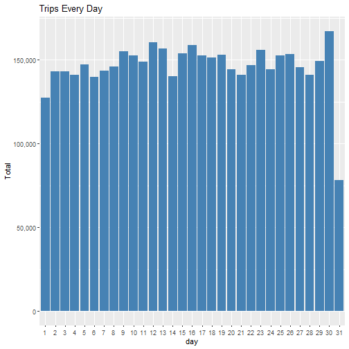

Trips during months in a year


```r
month_group <- data_2014 %>%
    group_by(month) %>%
    dplyr::summarize(Total = n())
datatable(month_group)
```

```
## Error in file(con, "rb"): cannot open the connection
```

```r
ggplot(month_group, aes(month, Total, fill = month)) +
    geom_bar(stat = "identity") +
    ggtitle("Trips by Month") +
    scale_y_continuous(labels = comma) +
    scale_fill_manual(values = colors)
```

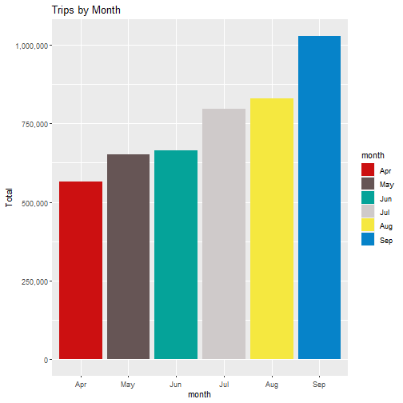

Trips by Month and Dayofweek


```r
month_weekday <- data_2014 %>%
    group_by(month, dayofweek) %>%
    dplyr::summarize(Total = n())

ggplot(month_weekday, aes(month, Total, fill = dayofweek)) +
    geom_bar(stat = "identity", position = "dodge") +
    ggtitle("Trips by Dayofweek and Month") +
    scale_y_continuous(labels = comma) + 
    scale_fill_manual(values = colors)
```

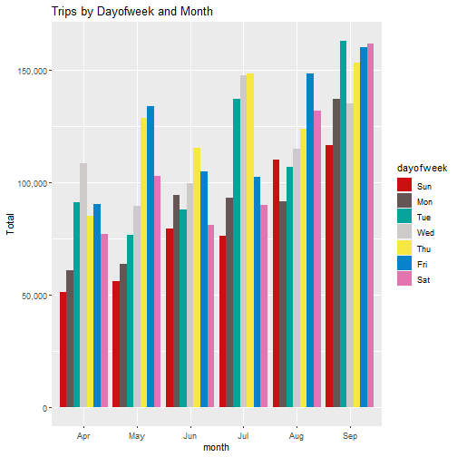


Trips by Bases


```r
ggplot(data_2014, aes(Base)) +
    geom_bar(fill = "steelblue") +
    ggtitle("Trips by Bases") +
    scale_y_continuous(labels = comma)
```

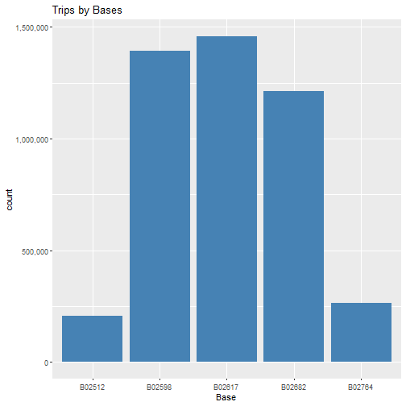

Trips by Bases and Month


```r
ggplot(data_2014, aes(Base, fill = month)) +
    geom_bar(position = "dodge") +
    ggtitle("Trips by Bases and Month") +
    scale_y_continuous(labels = comma) +
    scale_fill_manual(values = colors)
```

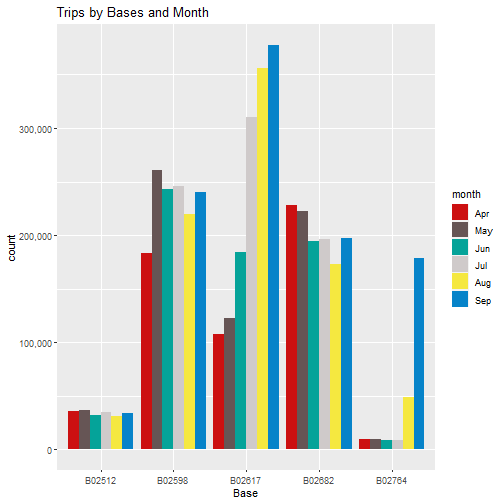

Trips by Bases and Dayofweek


```r
ggplot(data_2014, aes(Base, fill = dayofweek)) +
    geom_bar(position = "dodge") +
    ggtitle("Trips by Bases and Dayofweek") +
    scale_y_continuous(labels = comma) +
    scale_fill_manual(values = colors)
```

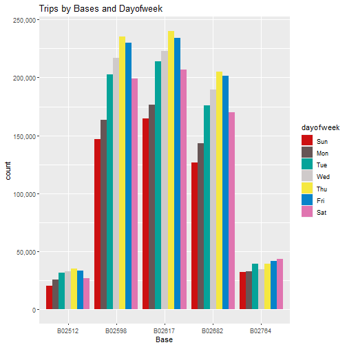

Heatmap by day and hour


```r
day_hour <- data_2014 %>% 
    group_by(day, hour) %>%
    dplyr::summarize(Total = n())
datatable(day_hour)
```

```
## Error in file(con, "rb"): cannot open the connection
```

```r
ggplot(day_hour, aes(day, hour, fill = Total)) +
    geom_tile(color = "white") +
    ggtitle("Heatmap by Day and Hour")
```

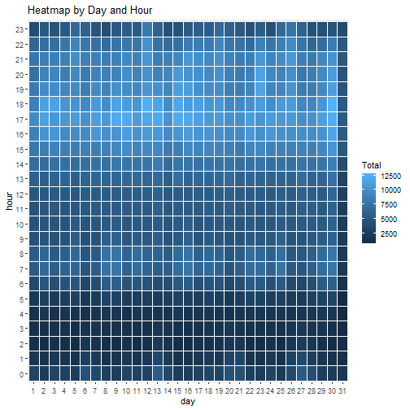

Heatmap by Month and Day


```r
month_day <- data_2014 %>% 
    group_by(month, day) %>%
    dplyr::summarize(Total = n())

ggplot(month_day, aes(day, month, fill = Total)) +
    geom_tile(color = "white") +
    ggtitle("Heatmap by Month and Day")
```

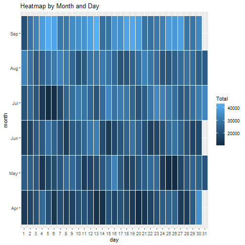

Heatmap by Month and Weekday


```r
ggplot(month_weekday, aes(dayofweek, month, fill = Total)) +
    geom_tile(color = "white") +
    ggtitle("Heatmap of Month and Weekday")
```

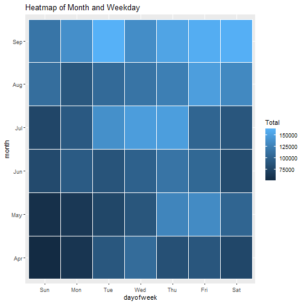

Heatmap by Bases and Month


```r
base_month <- data_2014 %>%
    group_by(Base, month) %>%
    dplyr::summarize(Total = n())

ggplot(base_month, aes(Base, month, fill = Total)) +
    geom_tile(color = "white") +
    ggtitle("Heatmap by Bases and Month")
```

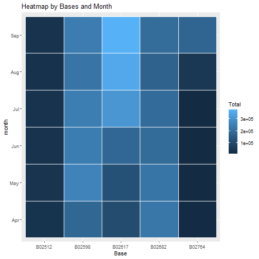

Heatmap by Bases and Weekdays


```r
base_weekday <- data_2014 %>%
    group_by(Base, dayofweek) %>%
    dplyr::summarize(Total = n())

ggplot(base_weekday, aes(Base, dayofweek, fill = Total)) +
    geom_tile(color = "white") +
    ggtitle("Heatmap of Bases and Weekdays")
```

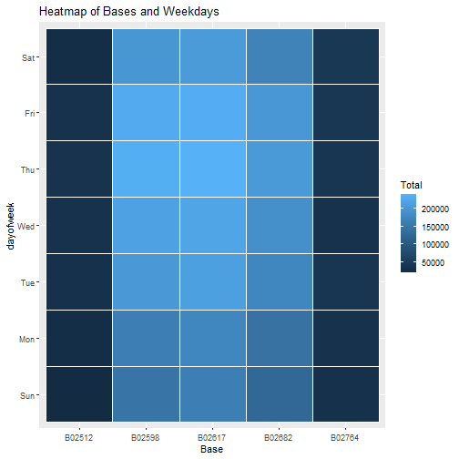


### Visualization Map of Rides in Newyork


```r
min_lat <- 40.5774
max_lat <- 40.9176
min_long <- -74.15
max_long <- -73.7004

data <- na.omit(data_2014)

ggplot(data, aes(Lon, Lat)) +
    geom_point(size =1, color = "blue") +
    theme_map() +
    scale_x_continuous(limits=c(min_long, max_long)) +
    scale_y_continuous(limits=c(min_lat, max_lat)) +
    ggtitle("New York Map Based On Uber Rides During 2014 From April To September")
```

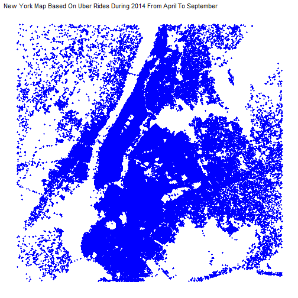

```r
ggplot(data, aes(x=Lon, y=Lat, color = Base)) +
    geom_point(size=1) +
    scale_x_continuous(limits=c(min_long, max_long)) +
    scale_y_continuous(limits=c(min_lat, max_lat)) +
    theme_map() +
    ggtitle("New York Map Based On Uber Rides During 2014 From April To September By Base")
```

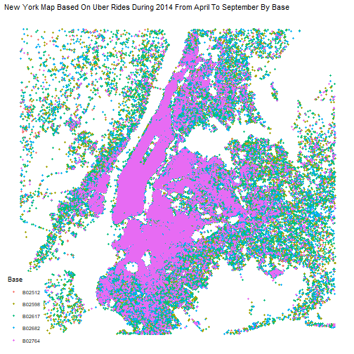


